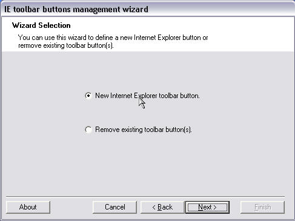



## toolbar buttons

### Description

Internet Explorer standard toolbar managment tool and library. you can add/remove tool bar buttons from the standard tool bar of IE.Extensions can easily be written to support other features.Run the wizard,reopen IE and right click the toolbar,Customize and you will find the new defined button.
 
### More Info
 
IE 5 or later required

             |
---                |---
**Submitted On**   |2003-05-11 04:24:10
**By**             |[Islam Elewady](https://github.com/Planet-Source-Code/PSCIndex/blob/master/ByAuthor/islam-elewady.md)
**Level**          |Intermediate
**User Rating**    |4.8 (19 globes from 4 users)
**Compatibility**  |VB 6\.0
**Category**       |[Internet/ HTML](https://github.com/Planet-Source-Code/PSCIndex/blob/master/ByCategory/internet-html__1-34.md)
**World**          |[Visual Basic](https://github.com/Planet-Source-Code/PSCIndex/blob/master/ByWorld/visual-basic.md)
**Archive File**   |[toolbar\_bu1586325112003\.zip](https://github.com/Planet-Source-Code/islam-elewady-toolbar-buttons__1-45411/archive/master.zip)

